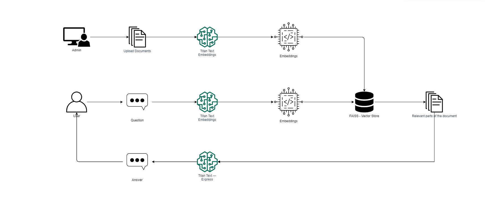
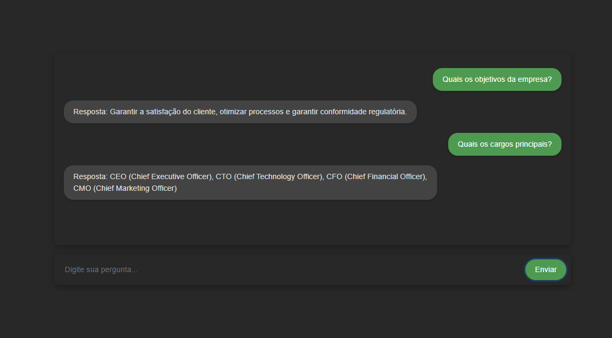

# Chatbot Personalizado com AWS Bedrock
Utilizando AWS Bedrock para Construção de Chat com IA Generativa com Conteúdos Incorporados

### 📋 Pré-requisitos

```
Node v20+
Conta AWS com credenciais configuradas (AWS_ACCESS_KEY_ID, AWS_SECRET_ACCESS_KEY, AWS_REGION)
Chave de acesso ao Bedrock habilitada
```

### 🔧 Instalação

```
npm install
```

### ⚙️ Executando 

No arquivo embedding-generator.ts contém o caminho para o "conteudo.txt" no qual é o arquivo utilizado para gerar os embeddings a partir do comando abaixo:
```
npm dev:chat-generator
```
Para rodar o Chatbot como um pequeno server para teste, basta executar: 
```Q
npm dev:chat-server
```
## Arquitetura do Projeto

O AWS Bedrock é um serviço da Amazon que oferece uma variedade de modelos de IA Generativa através de uma API unificada. Esses modelos podem automatizar tarefas como sumarização, geração de textos, análise de conteúdo e muito mais, permitindo a criação de soluções inteligentes e altamente personalizáveis.



### 🛠️ Construído com

* [AWS SDK Javascript v3](https://docs.aws.amazon.com/AWSJavaScriptSDK/v3/latest/client/lambda/command/InvokeCommand/)
* [LLMs - AWS Bedrock](https://aws.amazon.com/pt/bedrock/)
* [Langchain](https://js.langchain.com/docs/introduction/)

### Explicação

O sistema está dividido em duas partes principais: Administração e Indexação de Documentos. A primeira parte do sistema é voltada para a administração, permitindo que documentos específicos sejam carregados e processados pelos modelos Titan Embeddings. Esses embeddings fornecem uma representação vetorial dos documentos, capturando o significado do conteúdo. Os vetores gerados são armazenados no FAISS store integrado ao Langchain, que será usado para realizar consultas rápidas e eficientes posteriormente.

Consulta e Geração de Respostas: Na segunda parte, voltada para o usuário final, quando uma pergunta é feita ao chat, o sistema gera embeddings da consulta utilizando Titan Text Embeddings. Esses embeddings são comparados com os vetores armazenados no FAISS store, que identifica as partes mais relevantes dos documentos. Essas partes relevantes são recuperadas e incorporadas ao contexto (prompt), que será passado para a IA Generativa. Com base nesse contexto, a IA gera uma resposta precisa e relevante. O AWS Bedrock oferece diversos modelos de LLM, proporcionando flexibilidade em termos de desempenho e custo.

### Personalização e Escalabilidade

Embora a arquitetura seja comum em termos de conceito, ela é extremamente poderosa. Caso o foco seja em um chatbot, é possível utilizar uma variedade de tipos de arquivos, como PDF, TXT, DOCS, CSV, entre outros, para aumentar a base de conhecimento da IA.

Além disso, a ampla gama de modelos de LLMs disponíveis permite a criação de soluções que realizam análises avançadas e detalhadas de documentos, indo além das funcionalidades típicas de um chat simples.

A flexibilidade da arquitetura permite que a solução seja hospedada em ambientes serverless ou em infraestrutura dedicada, como em EC2 ou até mesmo utilizando Lambda e API Gateway para uma implementação mais ágil e escalável.

O conteúdo utilizado está presente na pasta assets `conteudo.txt`, nele contém um pequeno texto fictício de uma empresa de tecnologia gerado por IA para servir de alimentação para o Chatbot.

Chat:

